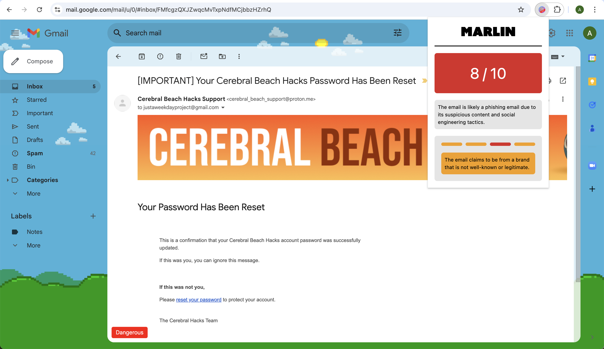

<h1 align="center">Marlin</h1>

<h3 align="center">A chrome extension leveraging AI to flag email phishing attempts while maintaining privacy!</h3>



## Contact

Check out our youtube demo video [here](https://www.youtube.com/watch?v=OsU3BGO6kYo) and our slideshow [here](https://pitch.com/v/marlin-66k8zp)! To contact us individually, visit our LinkedIn or GitHub profiles below.

Charlie Weinberger: [LinkedIn](https://www.linkedin.com/in/charlie-weinberger/) | [GitHub](https://github.com/charlieweinberger)
<br />
Dylan Vu: [LinkedIn](https://www.linkedin.com/in/dylanvu9/) | [GitHub](https://github.com/dylanvu)
<br />
Priyansh Shah: [LinkedIn](https://www.linkedin.com/in/priyansh-shah-569b3b224/) | [GitHub](https://github.com/Priyansh4444)
<br />
Aaron Ang: [LinkedIn](https://www.linkedin.com/in/aaron-ayd/) | [GitHub](https://github.com/aaron-ang)
<br />
Elvis Huynh: [LinkedIn](https://www.linkedin.com/in/elvis-huynh-b40746203/) | [GitHub](https://github.com/elvishuynh)
<br />

## Inspiration

In 2023, the FBI reported over 2.9B dollars in adjusted losses related to business email compromise. The weakest link in cybersecurity is the susceptibility of the human element to social engineering attacks such as phishing. Marlin is a Chrome extension that solves this issue by making it easy and accessible to securely analyze emails of any kind for hints of a phishing attempt.

## What it does

First, Marlin extracts data from an email and removes identifying information, such as usernames, date of births, and email addresses aside from the domain names. Next, it sends the email content to an LLM hosted by Kindo AI for evaluation. Finally, Marlin shows the user what is suspicious about the email and what the best course of action is.

## How we built it

On the frontend, we worked heavily with Chrome browser primitives and utilized Vite for faster code execution. We used React for an advanced UI, TypeScript for type safety, and Tailwind CSS for styling. On the backend, we utilized FastAPI. Once the email data is obtained, we used scrubadub in Python to remove any personal identifying information. Once that is done, we implemented data cleaning best practices based on prior academic research to reduce the load on the LLM.

Initially, we experimented with Kindo AI's low-code agents but found that while it produced details thinking steps, the response time was too long for our liking. We wanted quick and reliable insights. We played around with a bunch of models via the Kindo AI API, including WhiteRabbitNeo 33B. However, the response accuracy and quality were not satisfactory. Eventually, we settled on the open-source Mixtral model. Not only is this model very accurate, but it also helped us reach our privacy goals and enabled faster inference since only necessary data is sent to the LLM.

## Tech Stack

Frontend: React, TypeScript, Tailwind CSS, Vite
<br />
Backend/AI: Python, FastAPI, Mixtral, Kindo.ai

## Challenges we ran into

- Balancing security with privacy
- Minimizing alarm fatigue while still informing users of threats
- Integrating the web extension with our open-source LLM

## Accomplishments we're proud of

Even though we are sending potentially sensitive email data over the cloud to an LLM, we have minimized the risks associated with this by locally removing identifiable information before sending it to the cloud. We also implemented an open-source LLM as an additional step in ensuring user data is not used for nefarious purposes.

Alarm fatigue was something we were vastly aware of, so we took steps while designing the UX to mitigate this as much as possible. One big aspect of our extension is transparency with easily available information while not overwhelming the user with too much information such that they end up ignoring it altogether.

Our interactive data visualization system allows the user to understand the risk level of the email on a macro level at just a glance. If the user would like to know exactly which parts of the email are considered risky they can hover over color-coded bars to deep dive on a micro level what the LLM is thinking.

Just like in the healthcare industry, Marlin targets multiple levels of prevention. This extension focuses on primary and secondary prevention, meaning we help users not fall victim to phishing attacks and identify phishing attacks themselves.

## Future improvements

- Hosting the model on cloud platforms such as Modal with dedicated GPUs to achieve lower tail latencies
- Fine-tuning the model using public datasets of ham and spam eml files
- Improving the UI and UX of the Chrome extension by finding alternatives to grab the eml file without opening and closing a new tab
- Building an analytics dashboard that collects organization statistics
- Direct integration with email clients like Gmail or Outlook

## Sources

- [Spam-T5 paper](https://arxiv.org/pdf/2304.01238)
- [ChatSpamDetector paper](https://arxiv.org/pdf/2402.18093)
- [Phishing email dataset](https://github.com/rf-peixoto/phishing_pot/)
- [Enron email dataset](https://www.cs.cmu.edu/~enron/)

## Development Setup

### Backend

1. Change the directory to the backend folder using the following command:

```bash
cd backend
```

1. Install the required packages using the following command:

```bash
pip install -r requirements.txt
```

1. Run the FastAPI server using the following command:

```bash
fastapi dev main.py
```

### Frontend

1. Change the directory to the frontend folder using the following command:

```bash
cd frontend
```

1. Install the required packages using the following command:

```bash
npm ci
```

1. Run the Vite server using the following command:

```bash
npm run dev
```
